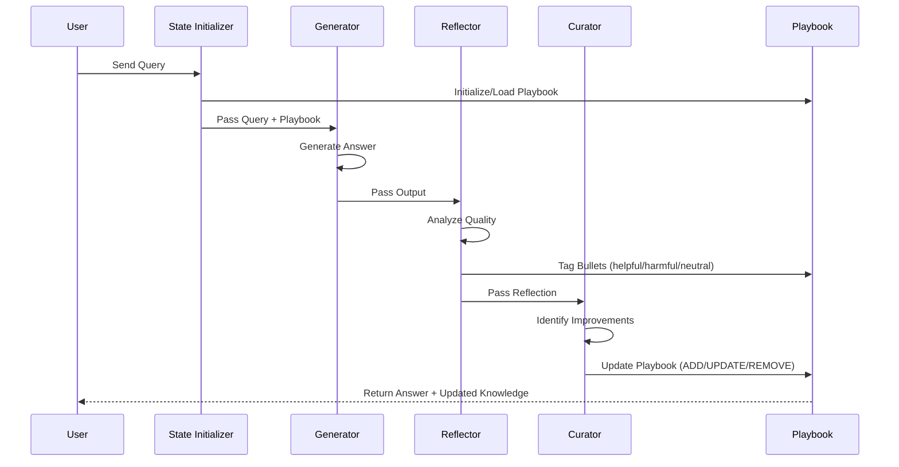

# ACE-ADK (Agentic Context Engineering – Agent Development Kit)

A production-ready implementation of Agentic Context Engineering using Google ADK. This agent system continuously improves its knowledge through a cycle of generation, reflection, and curation.

## 🚀 Quick Start

```bash
# 1. Install dependencies
uv sync

# 2. Configure API key
cp .env.example .env
# Edit .env and add your GOOGLE_API_KEY from https://aistudio.google.com/app/apikey

# 3. Run the application
uv run main.py

# 4. Open browser
# Navigate to http://localhost:8080
```

📖 **[Full Setup Guide](SETUP.md)** | ⚡ **[Quick Start Guide](QUICKSTART.md)**

## 🎯 What It Does

ACE-ADK implements a self-improving agent system that:

1. **Generates** answers using a dynamic playbook of learned strategies
2. **Reflects** on outputs to identify what worked and what didn't
3. **Curates** the playbook by adding, updating, or removing insights

Each interaction makes the agent smarter by updating its knowledge base.

## 🏗️ Architecture



### Agent Components

- **StateInitializer**: Sets up session state and initializes the playbook
- **Generator**: Creates answers using playbook strategies and reasoning traces
- **Reflector**: Analyzes outputs and tags playbook bullets by usefulness
- **Curator**: Updates the playbook with new insights and improvements

## 📁 Project Structure

```
ace-adk/
├── agents/
│   └── ace_agent/
│       ├── agent.py              # Main orchestration
│       ├── schemas/
│       │   ├── delta.py          # Delta operations (ADD/UPDATE/REMOVE)
│       │   └── playbook.py       # Playbook data structure
│       └── sub_agents/
│           ├── generator.py      # Answer generation
│           ├── reflector.py      # Output analysis
│           └── curator.py        # Playbook curation
├── config.py                     # Configuration management
├── main.py                       # Application entry point
├── pyproject.toml               # Project metadata & dependencies
├── requirements.txt             # Pip dependencies
├── .env.example                 # Environment template
└── README.md                    # This file
```

## 🔧 Configuration

### Required
- **GOOGLE_API_KEY**: Get from [Google AI Studio](https://aistudio.google.com/app/apikey)

### Optional
```env
# Model Configuration
GENERATOR_MODEL=gemini-2.5-flash
REFLECTOR_MODEL=gemini-2.5-flash
CURATOR_MODEL=gemini-2.5-flash

# Server Configuration
SERVE_WEB_INTERFACE=True
RELOAD_AGENTS=True
```

## 🎓 How It Works

### 1. Generation Phase
The Generator uses the playbook to create structured answers:
- Reviews relevant playbook strategies
- Provides step-by-step reasoning
- References specific playbook bullets used
- Produces a final answer

### 2. Reflection Phase
The Reflector analyzes the output:
- Identifies errors and their root causes
- Determines correct approaches
- Tags playbook bullets as helpful, harmful, or neutral
- Extracts key insights

### 3. Curation Phase
The Curator updates the playbook:
- **ADD**: New strategies and insights
- **UPDATE**: Improve existing bullets
- **REMOVE**: Delete incorrect or duplicate entries

### Playbook Structure
```python
{
  "bullets": {
    "strategy-00001": {
      "id": "strategy-00001",
      "section": "general",
      "content": "Always verify calculations before finalizing",
      "helpful": 5,
      "harmful": 0,
      "neutral": 1
    }
  },
  "sections": {
    "general": ["strategy-00001"]
  }
}
```

## 🛠️ Development

### Run with auto-reload
```bash
uvicorn main:app --reload --host 0.0.0.0 --port 8080
```

### Format code
```bash
uv run ruff format .
```

### Lint code
```bash
uv run ruff check .
```

### Run tests
```bash
uv run pytest
```

## 📊 Features

- ✅ Self-improving knowledge base
- ✅ Structured reasoning traces
- ✅ Automatic quality assessment
- ✅ Dynamic playbook management
- ✅ Web UI and API interface
- ✅ Comprehensive logging
- ✅ Type-safe with Pydantic
- ✅ Modern Python 3.13+ syntax

## 🔍 API Endpoints

Once running, access:
- **Web UI**: http://localhost:8080
- **API Docs**: http://localhost:8080/docs
- **OpenAPI Spec**: http://localhost:8080/openapi.json

## 📝 Example Interaction

**User Query**: "What is 15% of 240?"

**Generator Output**:
```json
{
  "reasoning": [
    "To find 15% of 240, I'll multiply 240 by 0.15",
    "240 × 0.15 = 36"
  ],
  "bullet_ids": ["math-00001"],
  "final_answer": "36"
}
```

**Reflector Output**:
```json
{
  "reasoning": "The calculation is correct...",
  "bullet_tags": [
    {"id": "math-00001", "tag": "helpful"}
  ]
}
```

**Curator Output**:
```json
{
  "reasoning": "Add strategy for percentage calculations",
  "operations": [
    {
      "type": "ADD",
      "section": "mathematics",
      "content": "For percentage calculations, convert % to decimal by dividing by 100"
    }
  ]
}
```

## 🐛 Troubleshooting

### Common Issues

**"Module not found" errors**
```bash
uv sync  # Reinstall dependencies
```

**"API key not found"**
- Ensure `.env` file exists
- Verify `GOOGLE_API_KEY` is set correctly
- No extra spaces around the key

**Port 8080 already in use**
```python
# In main.py, change:
uvicorn.run(app, host="0.0.0.0", port=8081)
```

See [SETUP.md](SETUP.md) for more troubleshooting tips.

## 📚 Documentation

- [SETUP.md](SETUP.md) - Detailed setup instructions
- [QUICKSTART.md](QUICKSTART.md) - 5-minute quick start
- [CHANGELOG.md](CHANGELOG.md) - Version history and changes

## 🤝 Contributing

Contributions welcome! Please:
1. Fork the repository
2. Create a feature branch
3. Make your changes
4. Submit a pull request

## 📄 License

MIT License - See LICENSE file for details

## 🙏 Acknowledgments

Built with:
- [Google ADK](https://github.com/google/adk) - Agent Development Kit
- [Pydantic](https://docs.pydantic.dev/) - Data validation
- [FastAPI](https://fastapi.tiangolo.com/) - Web framework
- [Gemini](https://ai.google.dev/) - Language models

## 📧 Support

- 📖 Check [SETUP.md](SETUP.md) for detailed instructions
- 🐛 Report issues on GitHub
- 💬 Join discussions in Issues

---

**Made with ❤️ using Google ADK and Gemini**
